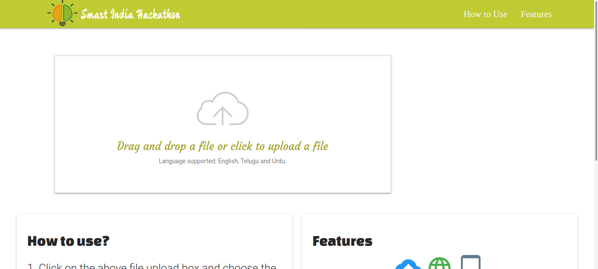
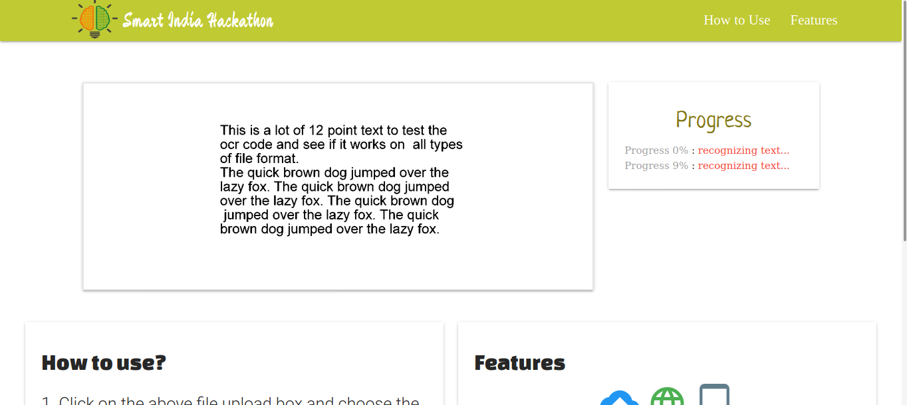
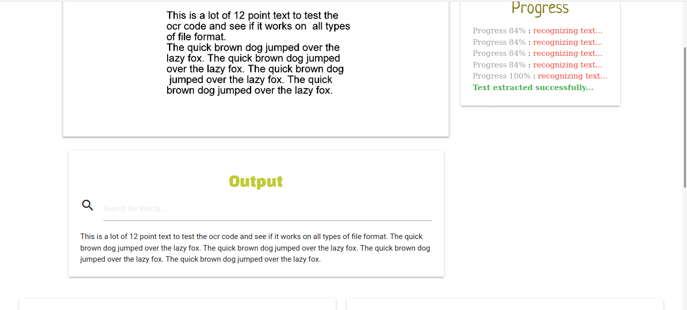
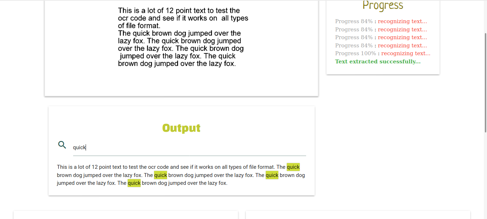

# OCR program to extract texts from a document(PDF or Image) with Search and highlight functionality.
This is a [SIH](https://www.sih.gov.in/) project on AI and OCR - To search Telugu &amp; Urdu words in PDF present in Unicode as well as in image format.
We got selected in **SIH finals** for this project.

# Screenshots

 

